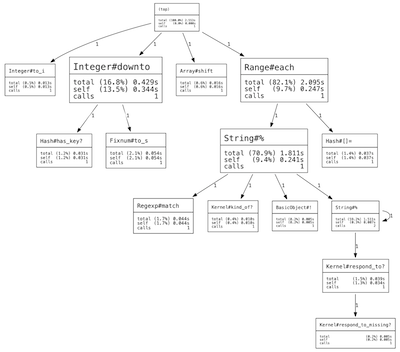

# DotProfilePrinter

A profile printer that outputs DOT files. DOT is a graph description format which can be rendered with GraphViz to make pretty graphs such as this:

It's heavily inspired by [perftools.rb](https://github.com/tmm1/perftools.rb), the best profiler I've ever used.

## Requiremets

JRuby 1.6+. You also need [GraphViz](http://graphviz.org/), or another compatible tool such as [CanViz](http://canviz.org), to render the graphs. GraphViz can be installed with Homebrew, apt, yum or be downloaded from [graphviz.org](http://graphviz.org/).

## The long version

The JRuby profiler can be used to profile a block of code like this:

    profile = JRuby::Profiler.profile do
      # your code goes here
    end

The `profile` variable holds all the profiling data, it must be converted to DOT format and written to a file:

    File.open('path/to/output.gv', 'w') do |io|
      printer = JRuby::Profiler::DotProfilePrinter.new(profile)
      printer.print_profile(io)
    end

Using the same code you can write JRuby's own (tabular) graph format (use `GraphProfilePrinter`) or HTML (use `HtmlProfilePrinter`). The built in profile printers can be used to get a report on the whole run too (e.g. `--profile.graph` or `--profile.html`), but because of some quirks with how JRuby sets up profiling it's not possible at this point to get a third party profiling printer to work that way -- at least not as far as I know.

In order to get profiling data you must run JRuby with the profiling API enabled, otherwise the profile output will be empty. This is done with the `--profile.api` flag:

    ruby --profile.api ...

You can also set it in the `JRUBY_OPTS` environment variable if you don't run your application with the `ruby` command:

    JRUBY_OPTS='--profile.api'

When you have a DOT file (i.e. the `.gv` file written by the code above), it can be rendered as a graph like this:

    dot path/to/dot.gv -Tpdf -o path/to/output.pdf

The `dot` command is part of GraphViz, make sure you have it installed. To find out which output formats are supported by your installation of GraphViz run `dot -Txxx`.

## Examples

Have a look in the examples directory and run `run.sh` to see some examples. For each `.rb` file in the directory it will generate a DOT file (`.gv`), a PNG and a PDF.

## Copyright

© 2012 Theo Hultberg